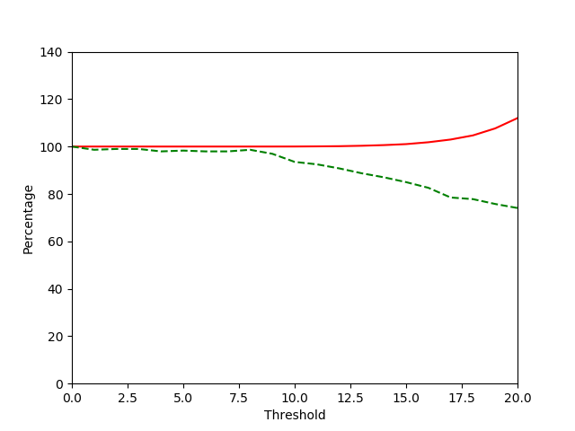
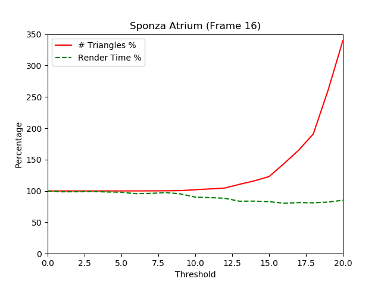
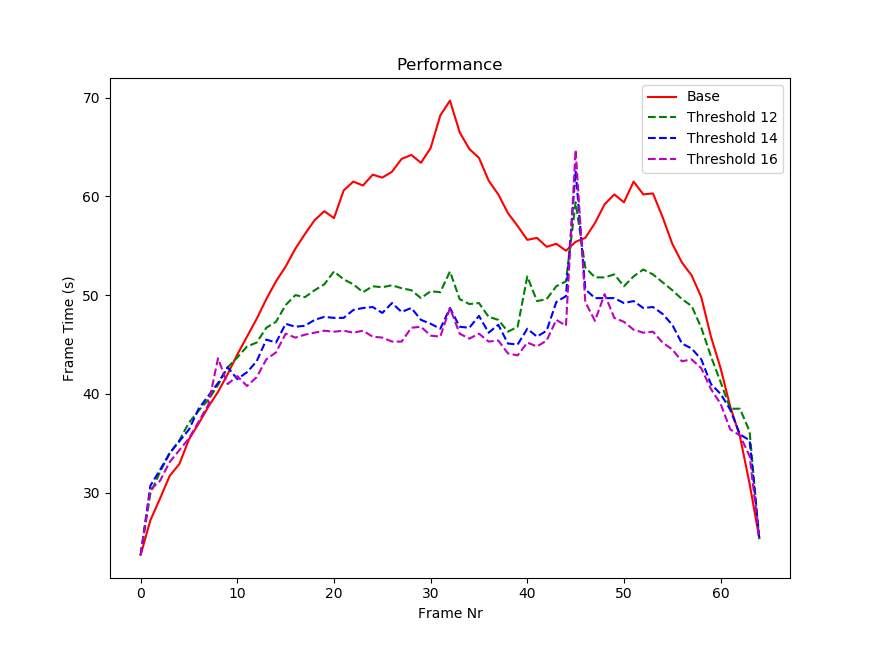
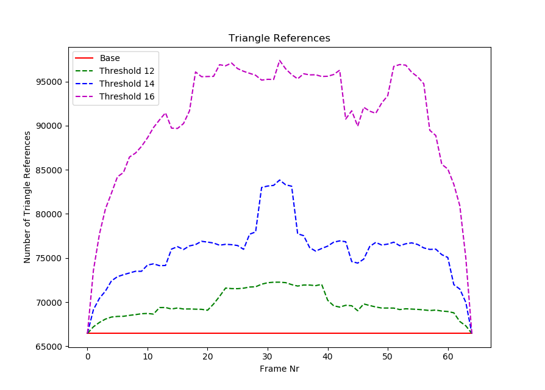

# PBRT Split Clipping

## Description
Extending the the PBRT path tracer (https://github.com/mmp/pbrt-v3) to use the Edge Volume Heuristic (Dammertz and Keller paper, [hw_docs/dammertz.pdf](hw_docs/dammertz.pdf)) to subdivide triangles to create better BVH's with less overlap. The main idea is that with a modest increase in triangle count, the overlap in BVH nodes can be reduced enough to gain a significant boost in rendering performance, especially for non-axis aligned geometry. 

## Primary changes made to PBRT

* core/api.cpp RenderOptions::MakeScene:
    - One pass over the primitives that don't have lights to find the scene volume used in the heuristic
    - One pass over the primitives to calculate how many new triangles and vertices will be generated per mesh by the subdivision
    - Loop over all the meshes to allocate the new ones that have enough space for the subdivision, and copy over old mesh vertex data
    - Final pass to actually subdivide each triangle
    
* shapes/triangle.cpp:
    - Added the struct "SubdivCountTriangle" which just takes in 3 vertex positions and a threshold, and returns how many triangles and vertices will result from subdivision
    - Added the struct "SubdivTriangle" which takes in the 3 triangle indices, threshold, new mesh. It recursively adds the newly subdivided triangles and vertices into the new mesh, and creates pbrt::Triangle's when subdiv is no longer needed.

* pbrt.cpp: Just added code to loop over several threshold values (T), and to log the output to a file instead of a terminal

## Results / Comparison to Paper Figures
All contained in the results/ folder.

### Spaceship Figure 4

### Sponza Figure 4

### Sponza Rotation Performance Figure 5

### Sponza Rotation Triangle Counts Figure 5

### Explanation
**NOTE:** Any comparison of rendering times from PBRT and the paper is going to be very different. Judging from the timings in figure 5, the lambertian-shading only images, and how drastic a difference the subdivision makes in figure 4-- the paper definitely used a simpler renderer. With a simpler renderer, the overall rendering time is going to be dominated by ray-scene intersection tests. As a result, any improvement in the BVH quality is going to result in a large difference in the overall rendering time. With PBRT though, there is a very non-trivial cost for illumination due to PBRT's complex BRDFs, texture lookups derivaties, etc. As a result, even if the ray-BVH intersection becomes 10x faster, a much smaller speedup will be seen in PBRT compared to the paper's renderer. The overall trend is more important to compare here.

#### Figure 4 results:
* Spaceship: The spaceship model used in the paper is actually a differenent model than the one I used. The paper one is over 6x as detailed, and consequently, the subdivision is going to be different and not really comparable. Regardless of that, the trend matches what the paper reports both for triangle counts and rendering speed.
* Sponza: The sponza model I used is presumed to be the same one used in the paper, as they both have 66 thousand triangles. The triangle counts are pretty much spot on. The rendering times again are not fully comparable, but certainly an improvement is seen as T increases.

#### Figure 5 results:
I tried to recreate the rotations as best as I could, but I think there were some differences here. Primarily: figure 5 in the paper says that the "base" (unsubdivided) geometry had 10k more triangles than Sponza has, which contradicts what figure 1 reports in the paper. I don't understand that, but with my results-- both rendering times and triangle counts follow the paper trends pretty well, besides for around frame 45. I am not positive what the spike is caused by. Looking at the logs, most scenes see an increase in the ratio of hit triangles to total triangle tests when there is more subdivision. With frame 45 though, the subdivision actually reduces that ratio. If that ratio goes down, it makes sense that the rendering time would go up, because more work has to be done to find which triangle the a ray hits on average. I can only guess that for that particular geometry and orientation, the unsubdivided BVH was actually pretty good already. PBRT uses a very approximate greedy approach to finding BVH splits, so it is possible that sometimes it finds rather poor splits.